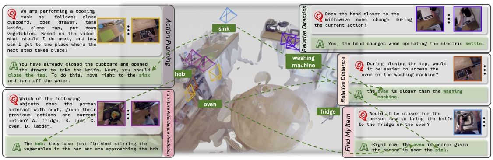

<div align="center">

# 🧠 Spatio-Temporal LLM: Reasoning about Environments and Actions from Egocentric Videos and 3D Scenes**

[📄 Paper (arXiv)](https://arxiv.org/abs/2507.05258) | [🌐 Project Website](https://zoezheng126.github.io/STLLM-website/) | [📁 Data & Checkpoints (Google Drive)](https://drive.google.com/drive/folders/1qX9Pn50NFR_dNuz6eH3TnQPZDtwQu0W8?usp=drive_link)

</div>



---

## 🧭 Overview

**ST-LLM** is a Spatio-Temporal Large Language Model designed to reason jointly over egocentric video, 3D point clouds, and natural language. It is evaluated on the newly proposed **REA (Reasoning about Environments and Actions)** dataset, covering five fine-grained tasks:

- **Relative Direction**
- **Relative Distance**
- **Find My Item**
- **Furniture Affordance Prediction**
- **Action Planning**

Our method introduces a cross-modal alignment module and positional encoding to fuse local temporal cues with global spatial scene context, significantly improving task performance over existing MLLMs.

---

## 🚧 Project Status

We are actively improving this repository. Below is a summary of what is already released and what’s still in progress.

### ✅ Done

- [x] Improved REA dataset
- [x] Released training and inference code
- [x] Uploaded REA question-answer dataset
- [x] Uploaded 3D point cloud data
- [x] Released [arXiv preprint](https://arxiv.org/abs/2507.05258)

### 🔜 Upcoming

- [ ] Write complete training and usage instructions
- [ ] Upload inference code
- [ ] Upload a small batch of example data
- [ ] Refactor and clean up the repository
- [ ] Reconstruct video-level point clouds with updated pipeline

---

## ⚙️ Quick Start

<details>
<summary><b>Environment Setup</b></summary>

We recommend using Python 3.8 and CUDA 11.8.

```bash
# (coming soon)
pip install -r requirements.txt
```

We provide a simple script to run inference on a sample REA QA example. Make sure the pretrained weights and sample data are properly downloaded.
```
(coming soon, currently eval code)
python LLaVA-NeXT/llava/train/inference.py
```

</details>


## 📊 Dataset: REA

The **Reasoning about Environments and Actions (REA)** dataset contains five types of spatio-temporal reasoning tasks:

- **Relative Direction**
- **Relative Distance**
- **Find My Item**
- **Furniture Affordance Prediction**
- **Action Planning**

Each QA sample in the dataset consists of:

- A short egocentric action video  
- A 3D point cloud of the environment  
- A Question-Answer pair

For more details, refer to our [project page](https://zoezheng126.github.io/STLLM-website/) or see Section 3 of our [paper](https://arxiv.org/abs/2507.05258). **Note:** We also provide the corresponding reconstruction images used to generate the 3D point cloud. These images can be used for **2D-LLM-based inference**, and are available in the [Google Drive](https://drive.google.com/file/d/1-FkbCSd6XMYV6IXospfXnAqeh6yfX2st/view?usp=drive_link).

<details>
<summary><b>Data Preparation</b></summary>

Before using our data or running any code, please download the **EPIC-KITCHENS** dataset (RGB video frames).  
We use the **downsampled version** of the videos for all processing.

- Official website: [https://epic-kitchens.github.io/2020](https://epic-kitchens.github.io/2020)
- Download the RGB frames (downsampled version) following their instructions.

### 📁 REA 3D Data
We release the 3D data on [Google Drive](https://drive.google.com/file/d/19KF-R6f1BcwnZHhZO_kmOlV68VoYSPrY/view?usp=drive_link).
This package contains:

- **Point clouds** reconstructed for each scene
- **Camera poses** for the egocentric action video  
  (32 uniformly sampled frames per clip)

Instructions to placed the data: Coming Soon!
</details>

---

## 🏗️ Model Architecture

**ST-LLM** combines three modalities:

- **Egocentric Video**: Captures local temporal context  
- **3D Point Cloud**: Encodes the global spatial layout  
- **Text Instruction**: The QA prompt to be answered  

We use a [**Q-Former-like cross-modal alignment module**](LLaVa-Next/llava/train/aligner.py) with [**3D positional encoding**](LLaVa-Next/llava/train/ray_encoder.py) to merge these modalities before feeding them into an LLM decoder.  

---

## 📦 Training
<details>
<summary><b>Training </b></summary>

```bash
bash LLaVA-NeXT/scripts/video/train/stllm_rea_train.sh
```
</details>

---

## 🔍 Evaluation
<details>
<summary><b>Evaluation </b></summary>

```bash
cd baseline_inference
```
To Evaluate LLaVA-Video-7B-Qwen2
```
python llava_video_qwen2_inference.py --start 0 --end -1 --cuda 0 \
    --json_path ../REA_dataset/qa_val_1757_v20.json \
    --rgb_dir /path/to/EPIC-KITCHENS/rgb \
    --pretrained lmms-lab/LLaVA-Video-7B-Qwen2 \
    --model_name llava_qwen \
    --scene_level_recon True \
    --pcd_folder /path/to/epic-kitchens-vggt-anyloc-val-scene
```

To evaluate LLaVA-OV-Qwen2-7B
```
python llava_video_qwen2_inference.py --start 0 --end -1 --cuda 0 \
    --json_path ../REA_dataset/qa_val_1757_v20.json \
    --rgb_dir /path/to/EPIC-KITCHENS/rgb \
    --pretrained lmms-lab/llava-onevision-qwen2-7b-ov \
    --model_name llava_qwen \
    --scene_level_recon True \
    --pcd_folder /path/to/epic-kitchens-vggt-anyloc-val-scene
```

To evaluate Qwen2-VL-7B-Instruct    
Modify the paths in the main function and run
```
python qwen2vl7binstruct_inference.py
```
</details>

## 🙏 Acknowledgments

We thank the authors of **EPIC-KITCHENS**, **VISOR**, **EPIC-FIELDS**, and **COLMAP** for their foundational work.  
This project also builds on frameworks like **LL3DA** and **VGGT**.  
We appreciate the compute support from the **Delta GPU cluster** and funding from the **National Science Foundation (NSF)**.

---

## 📜 License

This project is released under the [MIT License](LICENSE).

---

## 🔗 Citation

If you use our work, please cite:

```bibtex
@misc{zheng2025spatiotemporalllmreasoningenvironments,
      title={Spatio-Temporal LLM: Reasoning about Environments and Actions}, 
      author={Haozhen Zheng and Beitong Tian and Mingyuan Wu and Zhenggang Tang and Klara Nahrstedt and Alex Schwing},
      year={2025},
      eprint={2507.05258},
      archivePrefix={arXiv},
      primaryClass={cs.CV},
      url={https://arxiv.org/abs/2507.05258}, 
}