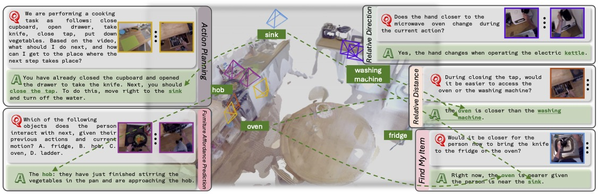

<div align="center">

# 🧠 Spatio-Temporal LLM: Reasoning about Environments and Actions from Egocentric Videos and 3D Scenes

[📄 Paper (arXiv)](https://arxiv.org/abs/2507.05258) | [🌐 Project Website](https://zoezheng126.github.io/STLLM-website/) | [📁 Data & Checkpoints (Google Drive)](https://drive.google.com/drive/folders/1qX9Pn50NFR_dNuz6eH3TnQPZDtwQu0W8?usp=drive_link)

</div>



---

## 🧭 Overview

**ST-LLM** is a Spatio-Temporal Large Language Model designed to reason jointly over egocentric video, 3D point clouds, and natural language. It is evaluated on the newly proposed **REA (Reasoning about Environments and Actions)** dataset, covering five fine-grained tasks:

- **Relative Direction**
- **Relative Distance**
- **Find My Item**
- **Furniture Affordance Prediction**
- **Action Planning**

Our method introduces a cross-modal alignment module and positional encoding to fuse local temporal cues with global spatial scene context, significantly improving task performance over existing MLLMs.

---

## 🚧 Project Status

We are actively improving this repository. Below is a summary of what is already released and what’s still in progress.

### ✅ Done

- [x] Improved REA dataset
- [x] Released training and inference code
- [x] Uploaded REA question-answer dataset
- [x] Uploaded 3D point cloud data
- [x] Released [arXiv preprint](https://arxiv.org/abs/2507.05258)

### 🔜 Upcoming

- [ ] Write complete training and usage instructions
- [ ] Upload inference code
- [ ] Build Dataset Visualizer
- [ ] Upload a small batch of example data
- [ ] Refactor and clean up the repository
- [ ] Reconstruct video-level point clouds with updated pipeline


---

## ⚙️ Quick Start

<details>
<summary><b>🛠️ Environment Setup</b></summary>

This guide walks through setting up the environment for training and inference with ST-LLM, including dependencies like [FlashAttention](https://github.com/Dao-AILab/flash-attention), [LLaVA-NeXT](https://github.com/LLaVA-VL/LLaVA-NeXT/tree/main), [MinkowskiEngine](https://github.com/NVIDIA/MinkowskiEngine), [Openscene](https://github.com/pengsongyou/openscene/tree/main), [PointNet++](https://github.com/charlesq34/pointnet2), [Mask2Former](https://github.com/facebookresearch/Mask2Former), [Semantic-SAM](https://github.com/UX-Decoder/Semantic-SAM), and [Deformable DETR](https://github.com/fundamentalvision/Deformable-DETR).

Step 1. Create Conda Environment
```bash
export Main=$(pwd)
conda create -n stllm python=3.9
conda activate stllm
```

Step 2. Install PyTorch (2.4.1) with CUDA (11.8)

MinkowskiEngine requires CUDA version < 12.0.
```bash
conda install pytorch==2.4.1 torchvision==0.19.1 torchaudio==2.4.1 pytorch-cuda=11.8 -c pytorch -c nvidia
```

Step 3. Install Build Tools
```bash
pip install ninja setuptools==69.5.1 
```
✅ Ensure ninja is in your PATH. You can check this with:
```bash
which ninja
```

Step 4. Install FlashAttention (v2.5.7)

```bash
TMPDIR=/tmp \
PIP_CACHE_DIR=/tmp/pip-cache \
TORCH_EXTENSIONS_DIR=/tmp/torch-extensions \
TRITON_CACHE_DIR=/tmp/triton-cache \
MAX_JOBS=4 \
pip install -v flash-attn==2.5.7 --no-build-isolation
```

Step 5. Install [LLaVA-NeXT](https://github.com/LLaVA-VL/LLaVA-NeXT/tree/main)
```bash
cd LLaVA-NeXT
pip install -e ".[train]"
```

Step 6. Install [OpenScene](https://github.com/pengsongyou/openscene) 
```bash
conda install conda-forge::openexr
conda install openblas-devel -c anaconda # Please find a way to install openblas

# Install MinkowskiEngine
git clone https://github.com/NVIDIA/MinkowskiEngine.git
cd MinkowskiEngine
python setup.py install --blas=openblas
```

Step 7. Install [PointNet++](https://github.com/charlesq34/pointnet2) and accelerated giou from source:
```bash
cd LLaVA-NeXT/llava/model/openscene/third_party/pointnet2
python setup.py install
cd ../utils
python cython_compile.py build_ext --inplace
```

Step 8. Install Python Dependencies

```bash
cd $Main
pip install -r requirements.txt
```

Step 9. Install [Deformable DETR](https://github.com/fundamentalvision/Deformable-DETR)
```bash
git clone https://github.com/fundamentalvision/Deformable-DETR.git
cd Deformable-DETR
cd ./models/ops
sh ./make.sh
cd $Main
```
Step 10. Install [Semantic-SAM](https://github.com/UX-Decoder/Semantic-SAM) and [Mask2Former](https://github.com/facebookresearch/Mask2Former)
Please install Semantic-SAM follow their instructions on their repo.

```bash
# Install Mask2Former
cd Semantic-SAM
git clone https://github.com/facebookresearch/Mask2Former.git
cd Mask2Former/mask2former/modeling/pixel_decoder/ops
sh make.sh
```

Step 11. Substitute ```modeling_utils.py``` in ```Transformers``` package.
```bash
# Find the path to Tranformers
tf_path=$(python -c "import transformers; import os; print(os.path.dirname(transformers.__file__))")
echo "$tf_path"
cd $Main
mv modeling_utils.py "$tf_path"
```

</details>

<details>
<summary><b>⚡ Quick inference</b></summary>
  
We provide a simple script to run inference on a sample REA QA example. Make sure the pretrained weights and sample data are properly downloaded.
```
(coming soon, currently eval code)
python LLaVA-NeXT/llava/train/inference.py
```

</details>


## 📊 Dataset: REA

The **Reasoning about Environments and Actions (REA)** dataset contains five types of spatio-temporal reasoning tasks:

- **Relative Direction**
- **Relative Distance**
- **Find My Item**
- **Furniture Affordance Prediction**
- **Action Planning**

Each QA sample in the dataset consists of:

- A short egocentric action video (sampled from **EPIC-KITCHENS**)
- A 3D point cloud of the environment (REA 3D Data, see below)
- A Question-Answer pair (under REA_dataset)

For more details, refer to our [project page](https://zoezheng126.github.io/STLLM-website/) or see Section 3 of our [paper](https://arxiv.org/abs/2507.05258). **Note:** Currently, the point clouds are reconstructed **per scene**, rather than per video. This provides **more accurate geometry**, as the reconstructions are **manually verified and annotated by humans**. We will also provide the corresponding reconstruction image names used to generate the 3D point cloud. These images can be used for **2D-LLM-based inference**, and are available in the [Google Drive](https://drive.google.com/file/d/1-FkbCSd6XMYV6IXospfXnAqeh6yfX2st/view?usp=drive_link). 

<details>
<summary><b>Data Preparation</b></summary>

Before using our data or running any code, please download the **EPIC-KITCHENS** dataset (RGB video frames).  
We use the **downsampled version** of the videos for all processing.

- Official website: [https://epic-kitchens.github.io/epic-fields/](https://epic-kitchens.github.io/epic-fields/)
- Download the RGB frames (downsampled version) following their instructions.

### 📁 REA 3D Data
We release the 3D data on [Google Drive](https://drive.google.com/file/d/19KF-R6f1BcwnZHhZO_kmOlV68VoYSPrY/view?usp=drive_link).
This package contains:

- **Point clouds** reconstructed for each scene
- **Camera poses** for the egocentric action video  
  (32 uniformly sampled frames per clip)

Instructions to place the data: To be provided.
</details>

---

## 🏗️ Model Architecture

**ST-LLM** combines three modalities:

- **Egocentric Video**: Captures local temporal context  
- **3D Point Cloud**: Encodes the global spatial layout  
- **Text Instruction**: The QA prompt to be answered  

We use a [**Q-Former-like cross-modal alignment module**](LLaVA-NeXT/llava/train/aligner.py) with [**3D positional encoding**](LLaVA-NeXT/llava/train/ray_encoder.py) to merge these modalities before feeding them into an LLM decoder.  

---

## 📦 Training

<details>
<summary><b>Training </b></summary>

```bash
bash LLaVA-NeXT/scripts/video/train/stllm_rea_train.sh
```
</details>

---

## 🔍 Evaluation

<details>
<summary><b>Evaluation </b></summary>

```bash
cd baseline_inference
```
To Evaluate LLaVA-Video-7B-Qwen2
```
python llava_video_qwen2_inference.py --start 0 --end -1 --cuda 0 \
    --json_path ../REA_dataset/qa_val_1757_v20.json \
    --rgb_dir /path/to/EPIC-KITCHENS/rgb \
    --pretrained lmms-lab/LLaVA-Video-7B-Qwen2 \
    --model_name llava_qwen \
    --scene_level_recon True \
    --pcd_folder /path/to/epic-kitchens-vggt-anyloc-val-scene
```

To evaluate LLaVA-OV-Qwen2-7B
```
python llava_video_qwen2_inference.py --start 0 --end -1 --cuda 0 \
    --json_path ../REA_dataset/qa_val_1757_v20.json \
    --rgb_dir /path/to/EPIC-KITCHENS/rgb \
    --pretrained lmms-lab/llava-onevision-qwen2-7b-ov \
    --model_name llava_qwen \
    --scene_level_recon True \
    --pcd_folder /path/to/epic-kitchens-vggt-anyloc-val-scene
```

To evaluate Qwen2-VL-7B-Instruct    
Modify the paths in the main function and run
```
python qwen2vl7binstruct_inference.py
```
</details>

---

## 🙏 Acknowledgments

We thank the authors of **EPIC-KITCHENS**, **VISOR**, **EPIC-FIELDS**, and **COLMAP** for their foundational work.  
This project also builds on frameworks like [LL3DA](https://github.com/Open3DA/LL3DA/tree/main), [VGGT](https://github.com/facebookresearch/vggt), [FlashAttention](https://github.com/Dao-AILab/flash-attention), [LLaVA-NeXT](https://github.com/LLaVA-VL/LLaVA-NeXT/tree/main), [MinkowskiEngine](https://github.com/NVIDIA/MinkowskiEngine), [Openscene](https://github.com/pengsongyou/openscene/tree/main), [PointNet++](https://github.com/charlesq34/pointnet2), [Mask2Former](https://github.com/facebookresearch/Mask2Former), [Semantic-SAM](https://github.com/UX-Decoder/Semantic-SAM), and [Deformable DETR](https://github.com/fundamentalvision/Deformable-DETR).  
We appreciate the compute support from the **Delta GPU cluster** and funding from the **National Science Foundation (NSF)**.

---

## 📜 License

This project is released under the [MIT License](LICENSE).

---

## 🔗 Citation

If you use our work, please cite:

```bibtex
@misc{zheng2025spatiotemporalllmreasoningenvironments,
      title={Spatio-Temporal LLM: Reasoning about Environments and Actions}, 
      author={Haozhen Zheng and Beitong Tian and Mingyuan Wu and Zhenggang Tang and Klara Nahrstedt and Alex Schwing},
      year={2025},
      eprint={2507.05258},
      archivePrefix={arXiv},
      primaryClass={cs.CV},
      url={https://arxiv.org/abs/2507.05258}, 
}
